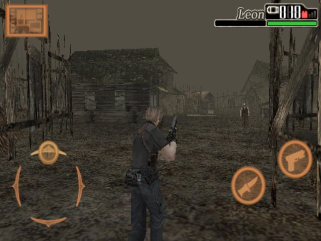

# Resident Evil 4 Platinum (iOS) for PortMaster

O **Resident Evil 4 Platinum / Mobile Edition** de iPhone (iOS 1.04.10) rodando o
**programa original do iOS** no seu portátil. Não é emulador: um runtime próprio
carrega o executável ARMv7 do jogo e atende as chamadas do iOS (UIKit,
Foundation, OpenGL ES 1, áudio e filmes) com as bibliotecas do sistema e a
Framework V6. Só o `.ipa` do próprio dono, versão 1.04.10, é aceito; o jogo não é
distribuído.

The iPhone **Resident Evil 4 Platinum / Mobile Edition** (iOS 1.04.10) running the
**original iOS program** on your handheld. Not an emulator: a purpose-built runtime
loads the game's ARMv7 executable and serves its iOS calls through the system
libraries and Framework V6. Only the owner's own 1.04.10 `.ipa` is accepted; the
game is not distributed.

- [Instalação / Installation](INSTALLATION.md)

## Download

- [residentevil4-ios-v1.0.2](https://github.com/NextOs-Ports/nextos-universal-ports/releases/tag/residentevil4-ios-v1.0.2) — `residentevil4-ios.zip`, `residentevil4-ios.zip.sha256`

- Todas as versões / all versions: [releases?q=residentevil4-ios](https://github.com/NextOs-Ports/nextos-universal-ports/releases?q=residentevil4-ios)

## Resumo / Summary

| | |
|---|---|
| Jogo / Game | Resident Evil 4 Platinum (Mobile Edition), iOS 1.04.10, `jp.co.capcom.res4` |
| Dados / Data | o seu `.ipa` em `residentevil4-ios/gamedata/` — extraído na primeira abertura pelo NXExtract |
| Arquitetura / Architecture | jogo ARMhf (32 bits), instalador AArch64 · GLIBC ≤ 2.28 |
| Testado / Tested | R36S (clone K36, dArkOS) |
| Sair / Exit | `SELECT + START` |

O pacote não inclui o jogo nem seus dados (BYO-data). / The package does not include the game or its data.
